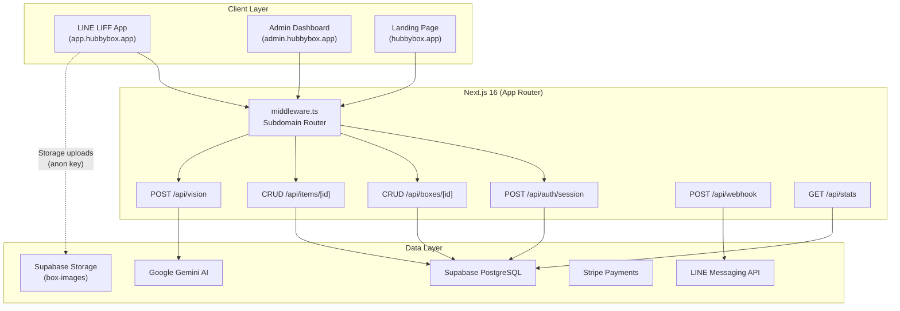
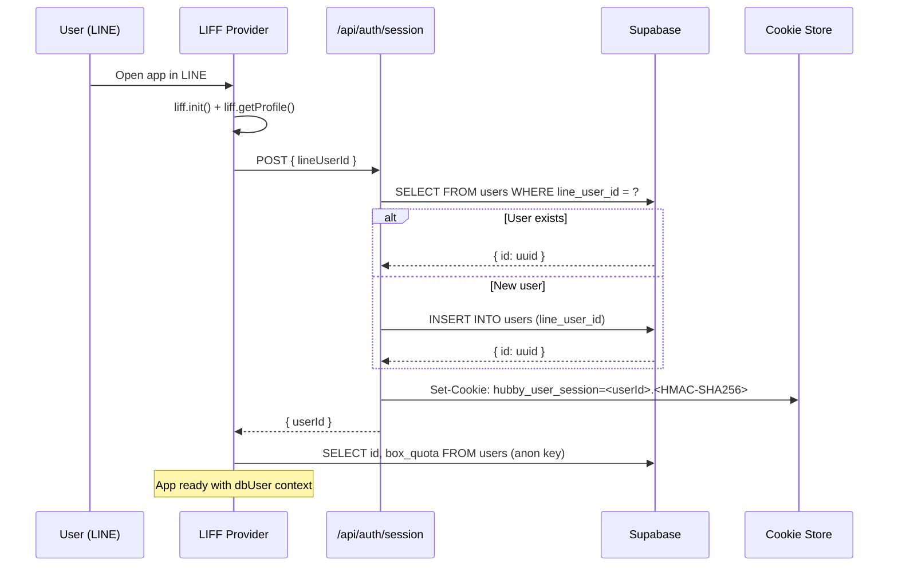
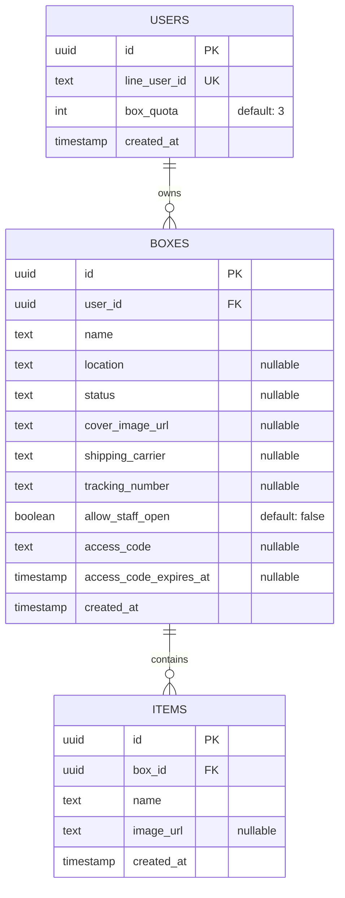
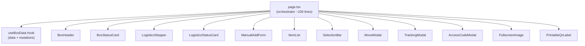

# HubbyBox — Architecture Documentation

## High-Level Architecture



## Authentication Flow



## Data Model



## Component Architecture (Box Detail)



## API Routes (Secured)

All mutation routes use HMAC-signed session cookies for authentication.

| Route | Method | Auth Guard | Purpose |
|:---|:---:|:---|:---|
| `/api/auth/session` | POST | None (creates session) | Create/find user + set cookie |
| `/api/boxes/[id]` | PATCH | `requireBoxOwner` | Update box fields |
| `/api/boxes/[id]` | DELETE | `requireBoxOwner` | Delete box + all items |
| `/api/boxes/[id]/items` | POST | `requireBoxOwner` | Add item (50 limit) |
| `/api/items/[id]` | DELETE | `requireItemOwner` | Delete single item |
| `/api/items/[id]` | PATCH | `requireItemOwner` | Move item to another box |
| `/api/items/bulk-move` | POST | `requireUser` + verify both boxes | Bulk move items |

## Subdomain Routing

`middleware.ts` inspects the `Host` header and rewrites paths:

```
hubbybox.app          → /landing_site/*
app.hubbybox.app      → /app_site/*
admin.hubbybox.app    → /admin_site/*
```

Development equivalents use `lvh.me`:
- `lvh.me:3000` → Landing
- `app.lvh.me:3000` → App
- `admin.lvh.me:3000` → Admin
